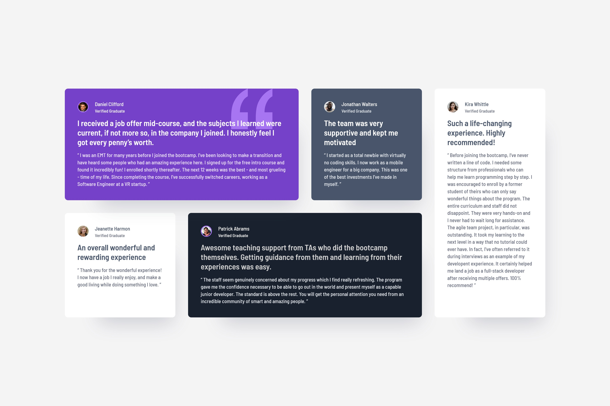

# Frontend Mentor - Four Card Feature Section 

## Table of contents

- [Overview](#overview)
  - [The challenge](#the-challenge)
  - [Screenshot](#screenshot)
  - [Live preview](#live-preview)
  - [Solution retrospective](#solution-retrospective)

## Overview

### The challenge

The challenge was to build out a testimonials grid section and get it looking as close to the design as possible.

### Screenshot

### Live preview

- Live Site URL: [Live preview](https://marioncts.github.io/Testimonial-Grid-Section/)

### Solution retrospective

At the moment, I am focusing on writing pure HTML and CSS before moving on to tools like Sass or Less. When I start a project, my first priority is to organize my workflow by outlining the steps I will take, the order in which I will complete them, and the solutions I plan to use (Flexbox, Grid, etc.). Once I have a clear overview, the first thing I do in CSS is define global variables for the design system based on the Figma design file. Then, I focus on selecting the most appropriate semantic elements for the HTML structure.

I am also training myself to better estimate the time required for each project. For this challenge, my initial estimate was four hours (from downloading the files and documenting my code to pushing the final solution to GitHub). In the end, I completed it in 3 hours and 15 minutes.

During a previous training course, I was taught to set the root font size to 10px in the HTML element (for CSS reset purposes), making it easier to work with rem values later (e.g., 10px = 1rem, 14px = 1.4rem, etc.). However, I am always open to learning better practices.

For the layout, I used grid-template-areas, which feels like the most intuitive approach for me. That said, if there is a more efficient practice, I would love to improve.

Until now, I have been more comfortable with Flexbox than Grid, so I was excited to explore Grid in more depth with this project.

I would greatly appreciate any feedback!